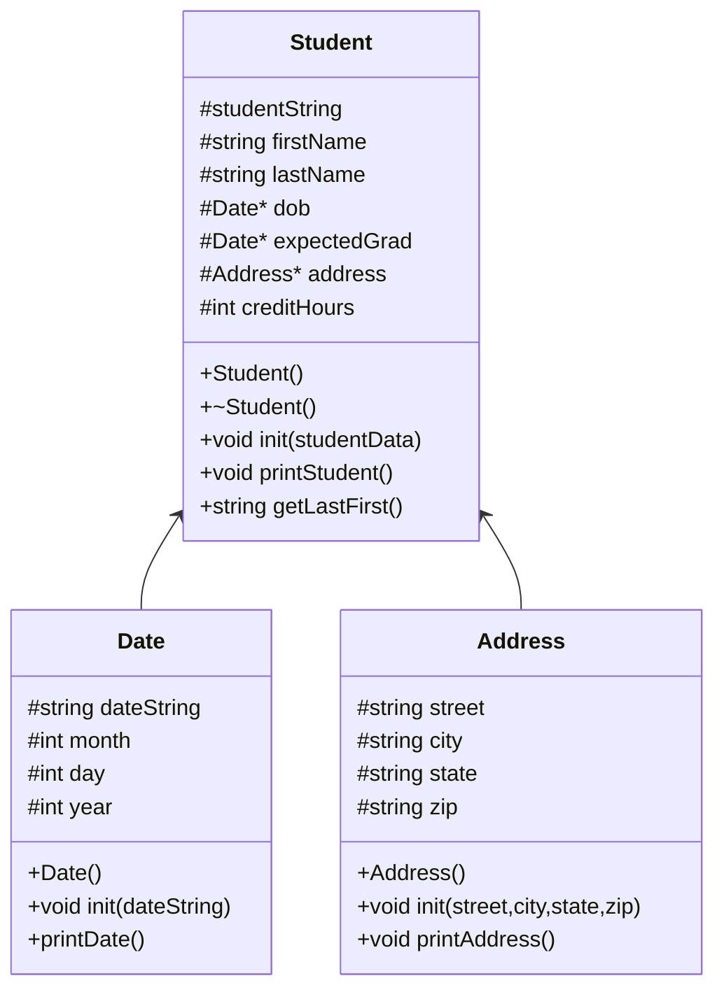

# heap-of-students
CS-121 Project to practice making a database 


### algorithm 
```
void loadStudents(students)
void printStudents(students vector)
void showStudentNames(students vector)
void findStudent(students vector)
void delStudents(students vector)
string menu()


int main()
 create vector students
 loadStudents(students)
 create bool keepGoing gets true

 while keepGoing is true
  if menu() equals 0
   keepGoing gets false
  else if menu() equals 1
   showStudentNames(students)
  else if menu() equals 2
   printStudents(students)
  else if menu() equals 3
   findStudent(students)
  else
   print "enter an integer 0-3"

 delStudents(students)


void loadStudents(students)
 infile stream inFile
 open "students.csv" with inFile

 while inFile is not at the end of the file
  
  
 
printStudents(students vector)
showStudentNames(students vector)
findStudent(students vector)
delStudents(students vector)
menu()


    
