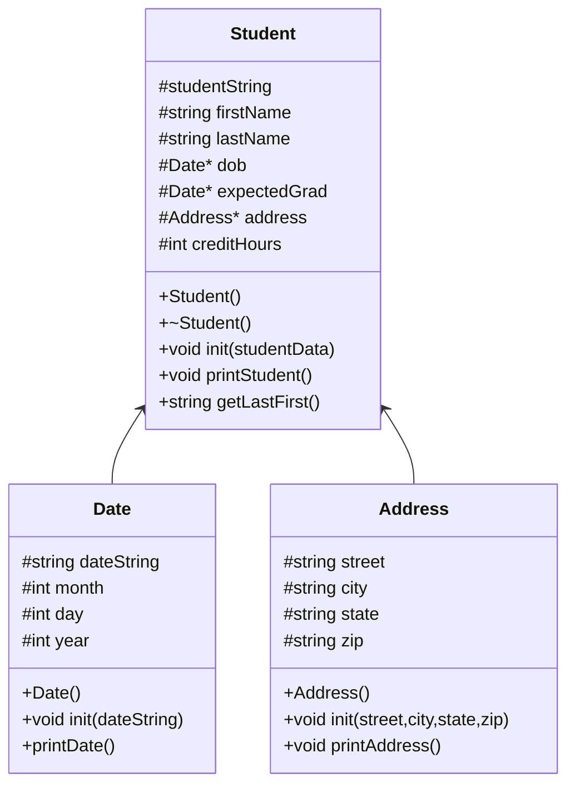

# heap-of-students
CS-121 Project to practice making a database 

```mermaid
classDiagram
 
    Student <-- Date 
    Student <-- Address
    class Address {
        #string street
        #string city
        #string state
        #string zip
        +Address()
        +void init(street,city,state,zip)
        +void printAddress()
        
    }
    
    class Date{
      #string dateString 
      #int month
      #int day
      #int year
      +Date()
      +void init(dateString)
      +printDate()
    
    }

    class Student{
    #studentString
    #string firstName
    #string lastName
    #Date* dob
    #Date* expectedGrad
    #Address* address
    #int creditHours
    +Student()
    +~Student()
    +void init(studentData)
    +void printStudent()
    +string getLastFirst()


    }

```
    
