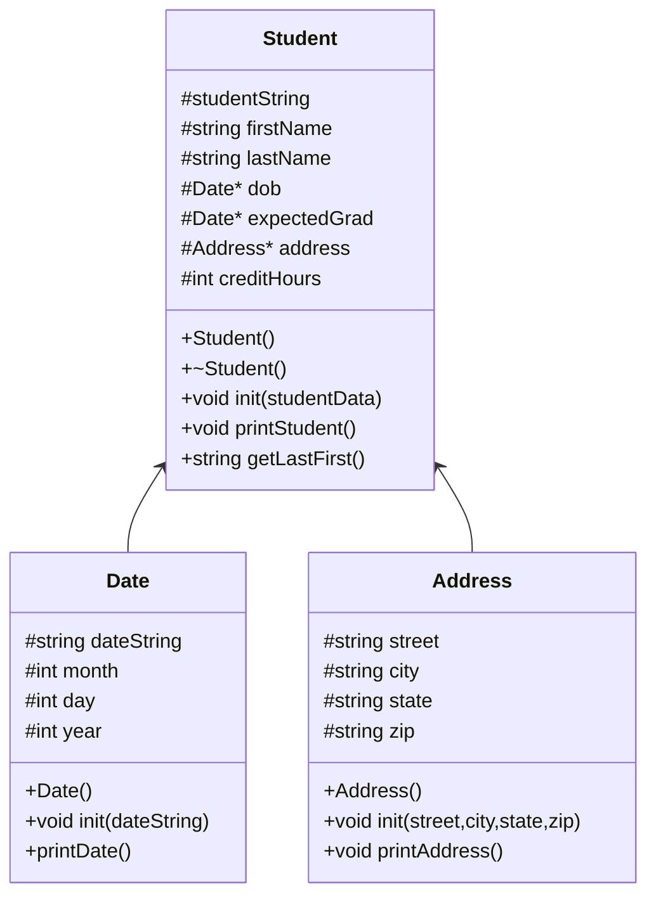

# heap-of-students
CS-121 Project to practice making a database 


### algorithm 
```
void loadStudents(students)
void printStudents(students vector)
void showStudentNames(students vector)
void findStudent(students vector)
void delStudents(students vector)
string menu()


int main()
 create vector students
 loadStudents(students)
 create bool keepGoing gets true

 while keepGoing is true
  if menu() equals 0
   keepGoing gets false
  else if menu() equals 1
   showStudentNames(students)
  else if menu() equals 2
   printStudents(students)
  else if menu() equals 3
   findStudent(students)
  else
   print "enter an integer 0-3"

 delStudents(students)


void loadStudents(students)
 create ifstream inFile
 create string studentString

 open "students.csv" with inFile
 while inFile is not at the end of the file
  getline from inFile, store to studentString
  create new Student student
  initialize student with studentString
  append student to the students vector 
  close the file 
  
  
printStudents(students vector)
 for each student in students
  student.printStudent()
  print "______" to separate data

showStudentNames(students vector)
 for each student in students
  student.getLastFirst()

findStudent(students vector)
 print "Last name of student: "
 get input and store in search

 for each student in students
  create string stream ss equal to student.getLastFirst()
  getline from ss, store to lastName, " " delimeter

  if lastName.find(search) isn't equal to std::string::npos
   print student's data

delStudents(students vector)
 for each studennt in students
 delete student

menu()
 print "
 0) quit
 1) print all student data
 2) print all student names
 3) find a student

 please choose 0-3: "
 store user input into choice
 return choice 


 


    
